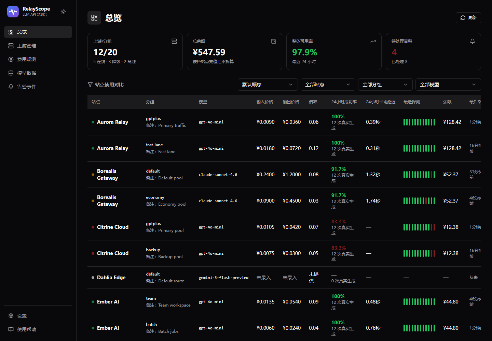
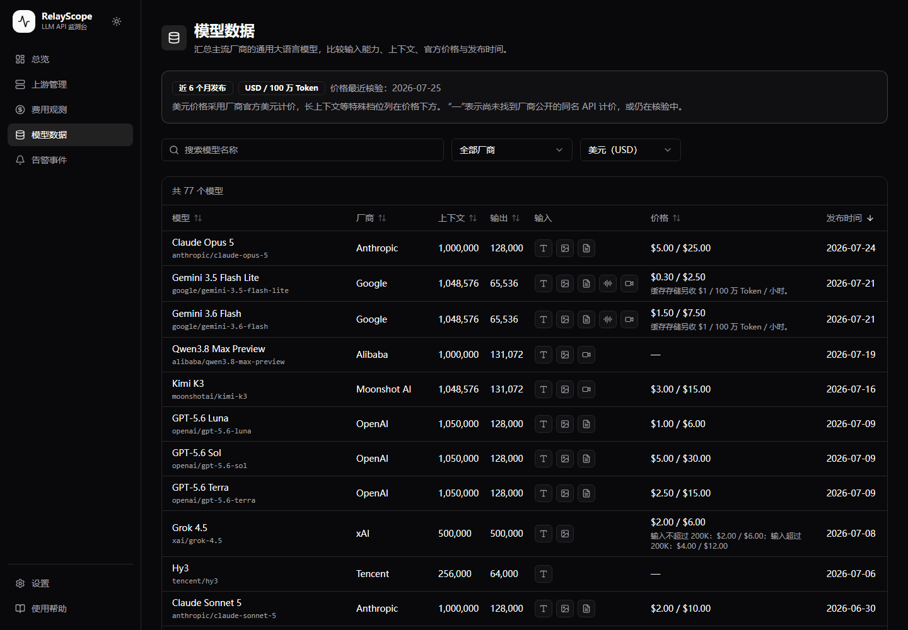
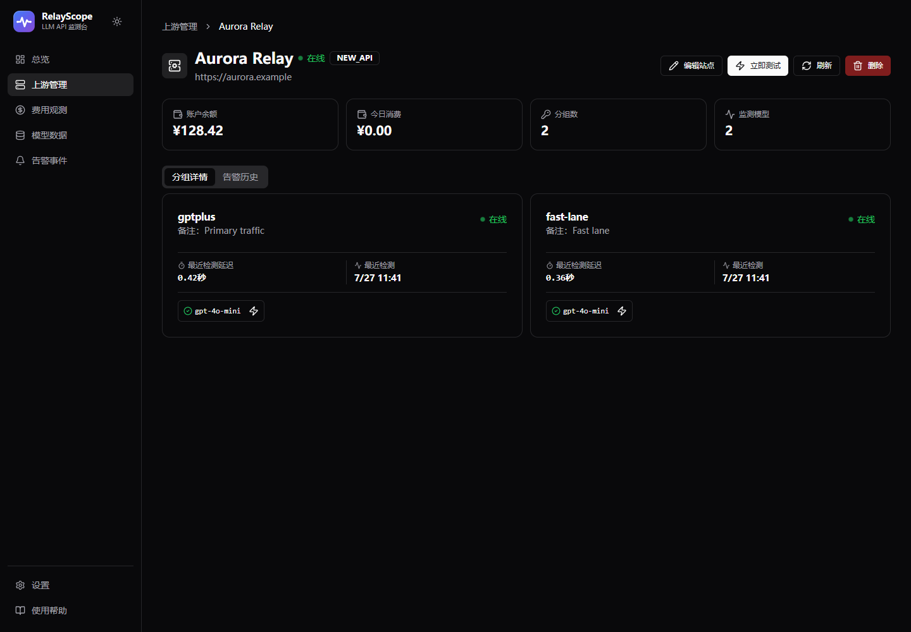
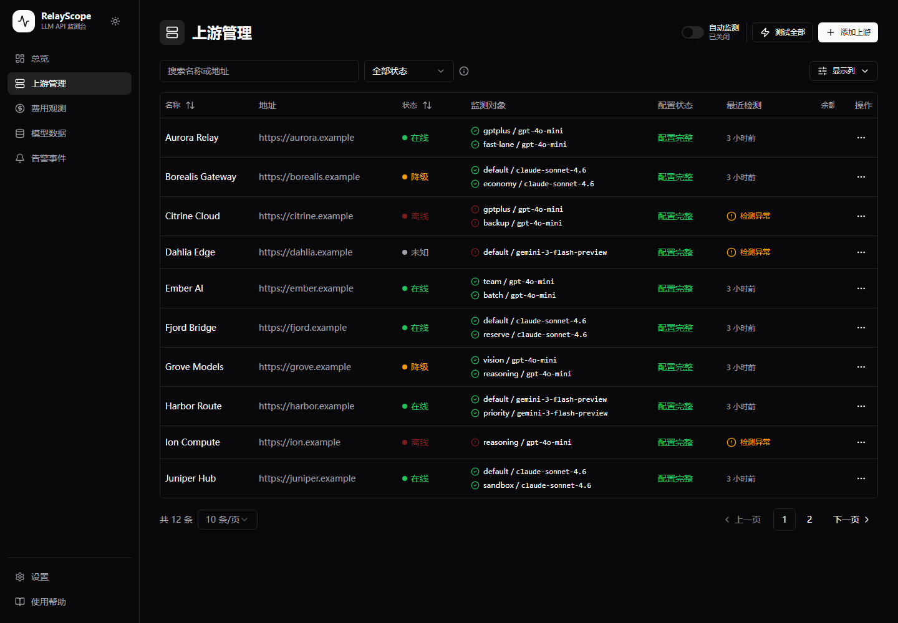
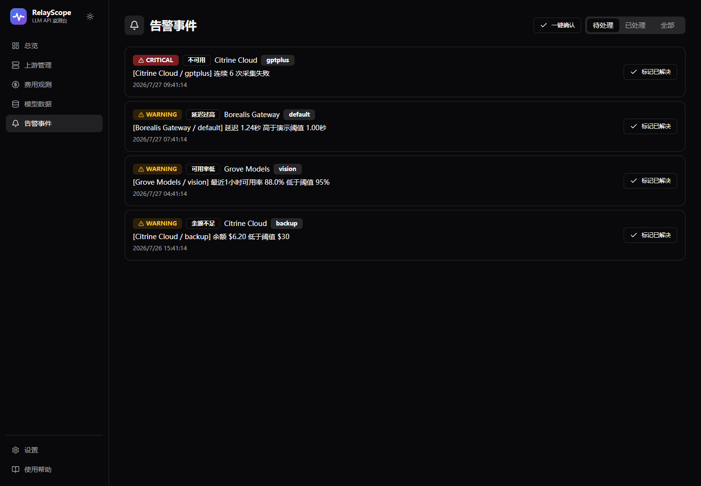
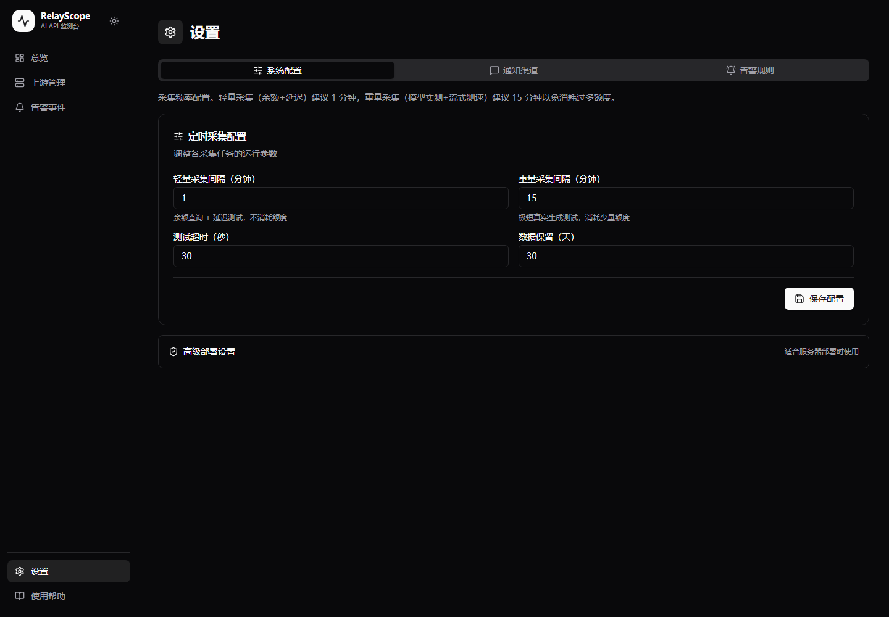
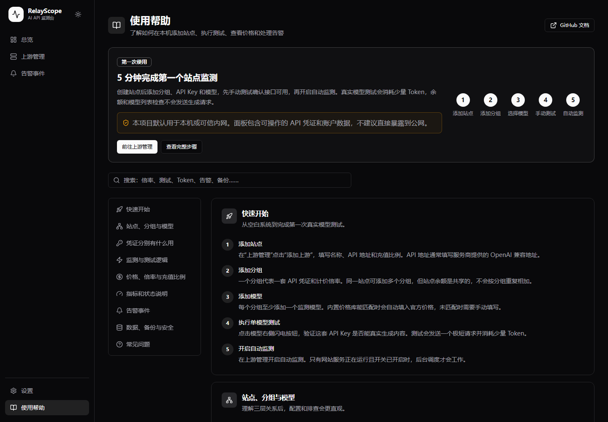
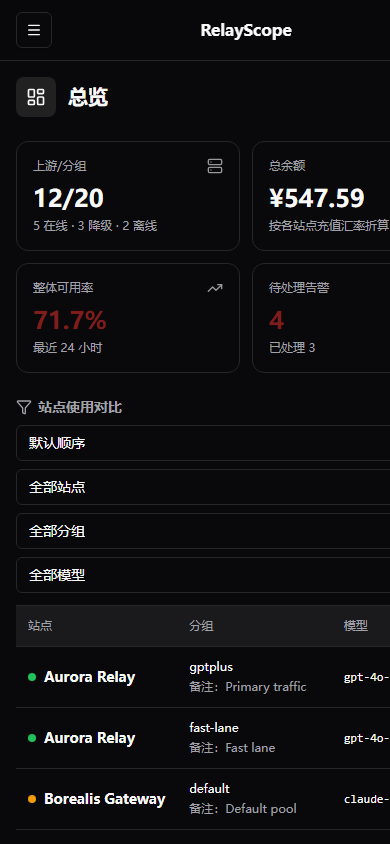
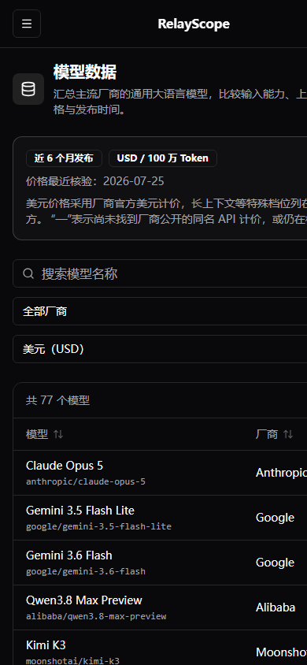

<div align="center">
  
  <h1>RelayScope</h1>
  <p><strong>把分散的 AI API、中转站和模型服务，放进同一张监测台。</strong></p>
  <p>统一查看余额、实际费用、价格倍率、真实生成成功率、延迟、模型状态与告警。</p>
  <p>
    <a href="https://github.com/dante1007108174-droid/relay-scope/actions/workflows/ci.yml"></a>
    <a href="https://github.com/dante1007108174-droid/relay-scope/releases"></a>
    <a href="LICENSE"></a>
    
    
    
  </p>
  <p>
    <a href="#windows-快速开始">Windows 快速开始</a> ·
    <a href="#docker">Docker</a> ·
    <a href="#界面预览">界面预览</a> ·
    <a href="docs/architecture.md">架构说明</a>
  </p>
</div>



RelayScope 是面向个人和小团队的自托管 LLM API 监测面板。它支持 New API、SUB2API 与通用 OpenAI Compatible 服务，用真实的小额生成请求确认“模型确实可用”，同时把站点余额、人民币价格、消费趋势和异常恢复放在一个界面里。

> [!IMPORTANT]
> RelayScope 会在本机保存 API 凭证和账户数据。官方配置只建议在个人电脑或可信内网运行，不建议把管理面板直接暴露到公网。

## 为什么用 RelayScope

| 统一观测 | 真实验证 | 费用与价格 |
| --- | --- | --- |
| 一个页面比较多个站点、分组和模型的余额、成功率与延迟。 | 轻量轮次不消耗模型 Token；定时真实生成验证模型是否真正可用。 | 根据余额下降累计实际人民币消费，并结合充值比例、分组倍率与官方价格。 |
| **状态与告警** | **模型资料** | **本地掌控** |
| 区分连通异常和真实模型失败，保留异常直到真实测试恢复，并支持飞书 Webhook。 | 内置主流厂商近期通用模型的上下文、模态、发布时间和官方 USD/CNY 价格。 | API 凭证加密写入本地 SQLite，支持一致性备份、深浅主题和移动端查看。 |

## 核心能力

- **多站点、多分组、多模型**：一套站点可以维护多组监测凭证，每组轮换检查多个模型。
- **低成本分层监测**：每分钟轻量检查余额和基础连通性；真实请求最多生成 5 Token，并按凭证串行避免任务冲突。
- **动态路由计价**：支持 New API/A6API 消费日志，尽可能还原实际路由模型、Token、缓存与倍率。
- **有行动价值的告警**：记录倍率变化、站点状态变更、凭证失效、连续限流和模型不可用，并在状态恢复后自动结束重复提醒。
- **可核对的费用观测**：只累计建站后共享余额的下降，不用局部日志拼凑无法对账的分组或模型费用。
- **原地配置与手动测试**：在站点详情维护分组和模型，不离开上下文即可发起独立模型测试。
- **顺手的 Windows 体验**：安装后使用一个桌面快捷方式和一个托盘图标；重复打开会回到已有浏览器标签。

## 界面预览

<table>
  <tr>
    <td width="50%"><br><sub>模型数据：检索近期模型、上下文、模态和官方价格</sub></td>
    <td width="50%"><br><sub>站点详情：管理分组与模型，查看实时状态并手动测试</sub></td>
  </tr>
  <tr>
    <td width="50%"><br><sub>上游管理：集中比较站点状态、余额和最近检测</sub></td>
    <td width="50%"><br><sub>事件中心：跟踪异常、恢复与确认状态</sub></td>
  </tr>
</table>

<details>
  <summary><strong>查看更多桌面端与移动端截图</strong></summary>
  <br>
  <table>
    <tr>
      <td width="50%"></td>
      <td width="50%"></td>
    </tr>
    <tr>
      <td align="center"><br><sub>移动端监测总览</sub></td>
      <td align="center"><br><sub>移动端模型数据</sub></td>
    </tr>
  </table>
</details>

> 截图由隔离的合成演示数据生成，不包含真实站点、账户或 API 凭证。

## Windows 快速开始

要求：Windows 10/11、[Node.js 22.5 或更高版本](https://nodejs.org/)和可访问 npm 的网络。

1. 在 GitHub Release 下载并解压 Source code。
2. 双击 `Setup RelayScope.cmd`。
3. 脚本会生成仅保存在本机的随机密钥、安装依赖、初始化 SQLite、完成生产构建并打开网页。
4. 安装完成后，桌面会出现一个 `RelayScope` 快捷方式，并在 Windows 系统托盘显示运行图标。
5. 双击快捷方式会立即在默认浏览器打开 RelayScope 启动页，并在后台启动服务；服务就绪后同一标签平滑进入监测台。再次双击快捷方式或从托盘选择“打开监测台”时，会切回已经存在的 RelayScope 标签，只有找不到该标签时才新建一个。托盘图标右键可打开监测台或退出。选择“退出”会关闭浏览器当前显示的 RelayScope 标签页，同时停止服务和自动监测。

桌面快捷方式由 `scripts/launch-relayscope.ps1` 先检查本地服务：服务已运行时直接打开监测台；服务未运行时并行打开本地启动页、预启动 Next.js 服务并唤起托盘，服务启动不再等待托盘 UI 初始化。启动页每 150 毫秒检查一次本地服务，并在服务就绪后通过原标签进入监测台；React 挂载完成后会主动结束 Edge 残留的文档加载状态，因此无需关闭启动页或弹出第二个标签。桌面快捷方式与托盘菜单共用 Windows 浏览器标签查找：先在 Edge、Chrome、Brave、Vivaldi、Firefox 或 Opera 中选中标题包含 RelayScope 的已有标签并恢复其浏览器窗口，找不到时才在默认浏览器新建标签；连续启动由命名互斥锁合并，避免同时创建多个标签。不显示 Windows 气泡提醒，也不会创建第二个托盘或服务进程。退出时只关闭浏览器窗口当前显示的 RelayScope 标签；浏览器最小化时通过 Chromium 后台命令关闭该标签，不恢复窗口，若已切换到其他网页则不会冒险误关。退出期间立即双击快捷方式时，新启动器会等待旧服务完全停止，然后自动接管并重启服务。首次安装脚本不会打印生成的密钥，也不会覆盖已有 `.env.local` 或数据库。项目移动到其他目录后，需要重新运行安装脚本以更新桌面快捷方式。也可在项目目录中直接双击 `RelayScope.cmd`；`Start RelayScope.cmd` 和 `Stop RelayScope.cmd` 继续作为无托盘的备用启停入口。

启动页和监测台共用 RelayScope 标签图标。监测台在 React 挂载完成后主动结束浏览器仍挂起的文档加载，再揭示完整界面，避免扩展或浏览器配置延迟顶层 `load` 事件时，界面已经可见但标签仍显示原生加载旋转。

## Docker

默认使用阿里云镜像 `crpi-dzjyl2rfnlfugj1m.cn-shanghai.personal.cr.aliyuncs.com/frogclaw/relay-scope:latest`，适用于 Linux 宝塔 Docker 编排，也可使用 Docker Desktop 或 Docker Engine with Compose。部署只需 `docker-compose.yml`，不需要上传源码、本地构建或另建 `.env`。

在宝塔中创建 Docker 编排并粘贴 `docker-compose.yml`，或将文件放到服务器的 `/www/wwwroot/relay-scope/`。启动前直接修改文件中的三个环境变量：

- `APP_ENCRYPTION_KEY`：至少 32 字符的随机密钥；迁移已有数据时沿用原值。
- `CRON_SECRET`：至少 32 字符的独立随机密钥。
- `ADMIN_PASSWORD`：至少 12 字符的管理员密码，首次初始化使用，用户名为 `admin`。

可在 Linux 终端用 `openssl rand -hex 32` 生成随机值，每项分别生成一次。若值中包含 `$`，在 Compose 中写为 `$$`；真实配置只保留在服务器。默认占位值会阻止启动。

```bash
cd /www/wwwroot/relay-scope
docker compose pull
docker compose up -d
docker compose ps
```

如果镜像仓库设为私有，先登录再拉取：

```bash
docker login crpi-dzjyl2rfnlfugj1m.cn-shanghai.personal.cr.aliyuncs.com
```

在宝塔“网站”中配置反向代理，目标地址填写 `http://127.0.0.1:5000`，为访问域名启用 HTTPS，再通过 HTTPS 域名登录。宿主机端口仅绑定本机；默认保持 `AUTH_DISABLED` 和 `NEXT_PUBLIC_AUTH_DISABLED` 为 `false`。生产登录 Cookie 需要 HTTPS；建议配合宝塔访问限制，仅允许自己或可信网络使用，不要将免登录面板直接暴露公网。

容器自动初始化 SQLite；仅当 `admin` 不存在时执行基础 seed 创建管理员、告警规则和设置。已有管理员时重启不会重置密码或设置，后续密码通过页面修改。数据库保存在 Docker volume `monitor_data` 的 `/data/monitor.db`；备份时同时保存数据卷和服务器上的 Compose 配置，恢复时保持原 Compose 项目名以复用原数据卷。

更新镜像时执行 `docker compose pull && docker compose up -d`。这个操作只拉取仓库中已发布的镜像，本地源码修改需要先构建并发布到该镜像地址才会生效。

停止服务：

```bash
docker compose down
```

不要在需要保留数据时执行 `docker compose down -v`，它会删除数据卷。

## macOS、Linux 与手动安装

项目固定使用 pnpm 11.9.0：

```bash
corepack enable
corepack prepare pnpm@11.9.0 --activate
cp .env.example .env.local
# 编辑 .env.local，替换 APP_ENCRYPTION_KEY、CRON_SECRET 和 ADMIN_PASSWORD
pnpm install --frozen-lockfile
pnpm db:generate
pnpm db:init
pnpm catalog:validate
pnpm build
pnpm start
```

开发模式使用 `pnpm dev`。生产使用应先执行 `pnpm build`，再运行 `pnpm start`。生产构建成功后会自动删除只用于加速后续构建的 `.next/cache`、Prisma 下载缓存和遗留临时引擎；这些文件不参与服务运行，清理不会影响启动或页面性能。

## 使用流程

1. 在“上游管理”添加站点，填写名称、API 地址和充值比例。
2. 为站点添加分组、专用监测 API Key 和至少一个模型。
3. 执行单模型测试，确认模型名称、流式响应和凭证兼容。
4. 根据需要补充 Access Token 与用户 ID，以读取部分 New API 平台的余额、日志和动态倍率。
5. 开启自动监测。网站服务停止后，本机调度也会随之停止。

在“上游管理”的“编辑上游”或详情页的“编辑站点”中，可以直接修改地址和各分组的 API Key，点击“保存”后一起生效。API Key 留空保持原值，已保存的密钥不会自动回显；分组、模型和 Access Token 仍可通过“分组和模型”编辑。

页面内置“使用帮助”，包含配置关系、测试成本、价格公式、状态口径、告警、备份和常见问题。

侧栏“模型数据”以左对齐宽表展示模型、厂商、上下文、最大输出、输入模态、价格与发布时间，并默认按发布时间从新到旧排列；点击模型、厂商、上下文、最大输出、价格或发布时间标题可切换升降序。页面提供按模型名称搜索、按厂商筛选以及 USD/CNY 展示切换，价格统一按每 100 万 Token 展示。人民币优先使用厂商官方人民币价，厂商未公布人民币价时才按页面所示固定参考汇率估算；换算值不参与站点实际费用计算。目录收录 models.dev 对齐的主流厂商最近 6 个月仍公开提供的通用大语言模型（含可理解图片等输入的模型，不含专门图片生成/编辑型号），并按发布时间从新到旧展示；每次 RelayScope 发版时人工审核更新。厂商未公布的字段显示为“—”。分档计价优先在价格下方列出各档数字，缺少完整数字时才保留文字说明，实际使用前应通过模型名称链接复核官方资料。

模型目录保存在版本化的 `data/model-catalog.json`，其中包含 `schemaVersion`、`catalogVersion`、更新时间、厂商来源、模型别名、近期展示模型以及 USD/CNY 结构化价格和分档。页面、自动填价和费用计算都通过 `src/lib/official-model-prices.ts` 读取这一份快照。更新目录时应递增 `catalogVersion`、更新 `updatedAt` 和各价格的 `verifiedAt`，然后运行 `pnpm catalog:validate`；`pnpm build` 也会自动先执行该校验。当前版本不会联网下载或自动覆盖目录。

## 监测与 Token 消耗

| 类型 | 默认频率 | 内容 | 模型 Token |
| --- | --- | --- | --- |
| 轻量检查 | 每分钟 | 余额、模型列表、基础连通性 | 不发送生成请求 |
| 自动真实测试 | 每 15 分钟 | 每个启用分组轮换测试一个模型 | 少量 |
| 手动模型测试 | 用户点击 | 指定凭证与模型的真实生成 | 少量 |

真实请求最多生成 5 Token。站点详情可同时发起不同分组和不同模型的手动测试；自动采集与全站测试仍按凭证排队，避免调度任务自身冲突。

> [!WARNING]
> 自动真实测试和手动模型测试都会向上游发送真实 API 请求，产生少量 Token 消耗和费用；轻量余额、模型列表与基础连通检查不发送生成请求。

## 指标口径

- **余额**：站点账户的共享余额，按照“1 元人民币获得的美元额度”统一换算成人民币，不按分组重复相加。
- **价格**：输入、输出、缓存读取和缓存写入均按每 100 万 Token 保存。
- **人民币价格**：`官方美元价格 × 分组倍率 ÷（1 元人民币获得的美元额度）`。
- **成功率**：最近 24 小时真实模型测试成功次数占比。
- **平均延迟**：最近 24 小时真实模型测试的完整响应耗时，界面以秒显示。
- **模型恢复**：真实测试失败后保持异常，只有同一模型下次真实测试成功才恢复；每分钟轻量检查不能覆盖模型异常。
- **最近探测**：对应最近一次真实生成测试，不是余额或模型列表检查。
- **检测中**：只在自动真实测试运行期间显示；每分钟轻量检查不会显示为模型检测中。
- **站点状态**：任一启用分组在线时站点显示在线；仅当没有在线分组时，才按其余分组显示降级、离线或未知。

New API/A6API 等动态路由平台会优先读取真实消费日志，还原本次路由的模型、输入、输出、缓存和分组倍率。日志读取本身不消耗模型 Token；实际数据优先于公开价格目录。

## 费用观测

侧栏“费用观测”提供昨日、近 7 天、全部和自定义时间范围。主卡片随所选范围显示对应消费，并固定补充今日消费、滚动近 30 天消费和当前余额；当前余额不受时间范围影响。金额逐段累计站点共享余额的下降量，并使用消费发生时的充值比例换算为实际人民币；余额增加只更新新基线，不会抵消历史消费。首个成功余额快照作为零基线，因此不会计入添加站点前的消费。消费趋势会按范围自动选择 15 分钟、6 小时、天、周或月粒度；选择单个站点时主趋势和当前余额自动切换为该站点。

费用观测只展示能够由余额下降统一核对的站点级费用，不展示分组或模型费用，也不会根据局部日志推测未知消费的归属。站点费用流水不随普通监测指标的保留期清理；删除站点时，对应费用流水一并删除。

费用趋势依赖 RelayScope 运行期间取得的余额快照。服务停止期间不会采样；重新启动后发现的余额净下降会集中记在首个新快照，能够补到账户净消费，但不能还原真实消费时间。如果停机期间同时发生充值和消费，只能观察到两者的净余额变化。

## 安全边界

- API Key 和 Access Token 使用 `APP_ENCRYPTION_KEY` 经 AES-256-GCM 加密后写入 SQLite。
- 浏览器常规接口不会返回密钥明文；API Key、Access Token 与 CRON_SECRET 只有用户显式点击小眼睛时才通过各自的专用端点读取，通知渠道列表只返回脱敏后的 Webhook 摘要。
- 系统设置、告警规则和通知渠道写接口使用服务端字段白名单与数值范围校验，未知字段不会直接传入数据库。
- `.env`、`.env.local`、数据库、备份、日志和本地 Agent 目录均不得提交 Git。
- Docker 构建上下文通过 `.dockerignore` 排除本机环境文件、可能含部署凭据的 `docker-compose.yml`、数据库、备份、依赖、构建产物和 Agent 目录，避免敏感数据进入中间层。
- 默认 Docker 端口绑定为 `127.0.0.1:5000`，免登录模式只适合本机或可信内网。
- 如果自行改造为公网服务，需要自行启用登录保护、HTTPS、防火墙、访问控制、速率限制和凭证轮换。

公开 GitHub 源码不会包含部署者自己的 API 数据；风险来自错误上传运行数据，或把正在运行的管理面板直接暴露给他人。

## 登录保护

本机默认启用免登录模式。需要登录时：

1. 将 `.env.local` 中 `AUTH_DISABLED` 和 `NEXT_PUBLIC_AUTH_DISABLED` 改为 `false`。
2. 设置安全的 `ADMIN_PASSWORD`。
3. 执行 `pnpm db:seed` 创建用户名为 `admin` 的管理员。
4. 重新执行 `pnpm build` 并启动服务。

## 备份与恢复

Git 只保存源码，不保存 SQLite、凭证或本机配置。手动完整备份：

```bash
pnpm db:backup
```

备份位于 Git 忽略的 `backups/<时间>/`，包含 SQLite 一致性快照、`.env.local` 和清单。它同时包含数据库与解密材料，属于敏感数据，不能上传或分享。

恢复时：

1. 停止 RelayScope。
2. 备份当前数据。
3. 用目标备份的 `dev.db` 替换 `prisma/dev.db`。
4. 用目标备份的 `.env.local` 替换项目根目录同名文件。
5. 删除旧的 `prisma/dev.db-wal` 和 `prisma/dev.db-shm`。
6. 重新启动服务。

## 开发与验证

技术栈：Next.js 15.5.21 App Router、TypeScript、Prisma、SQLite、Tailwind CSS。

```bash
pnpm test
pnpm lint
pnpm exec tsc --noEmit
pnpm build
```

架构和扩展边界参见 [docs/architecture.md](docs/architecture.md)，贡献流程参见 [CONTRIBUTING.md](CONTRIBUTING.md)，安全问题请阅读 [SECURITY.md](SECURITY.md)。

## 项目来源与许可证

RelayScope 基于 [yigehaozi/relay-status-monitor](https://github.com/yigehaozi/relay-status-monitor) 的 MIT 许可代码进行二次开发，并在此基础上扩展了多模型监测、价格与倍率观测、动态路由计价、并发队列、本地备份、帮助文档和响应式管理体验。

本项目继续采用 [MIT License](LICENSE)。你可以自行使用、修改和重新部署，但应保留许可证及原项目版权声明。
