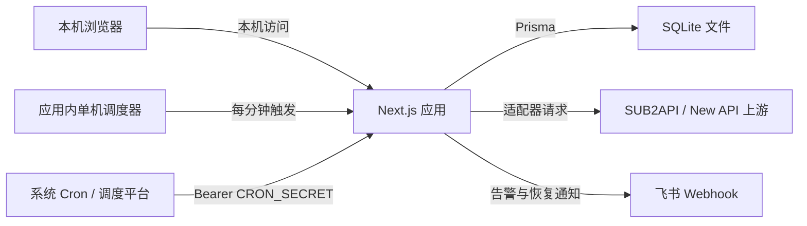
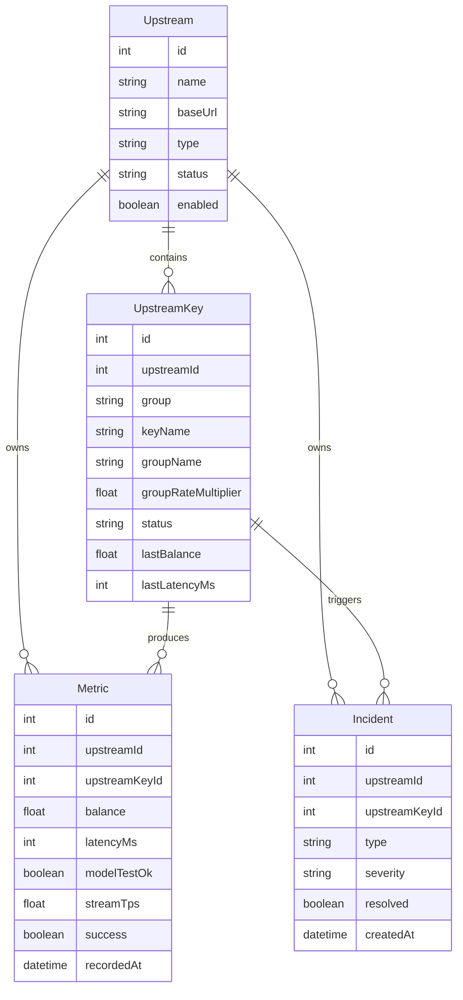
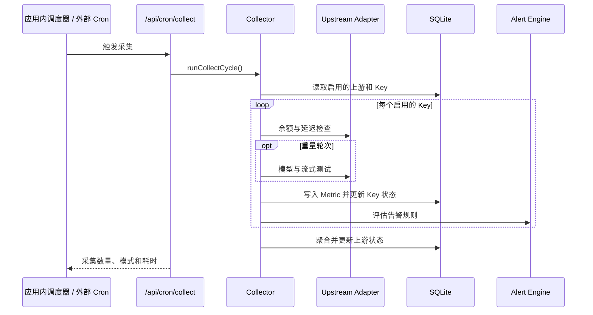

# RelayScope 系统架构

本文描述公开版本的系统边界、核心数据流和扩展方式。示例名称和地址均为合成内容。

## 设计目标

- 在一个面板中管理多个 AI API 中转站及其 Key/分组。
- 用轻量检查覆盖日常可用性，用低频重量测试验证真实生成能力。
- 将上游差异限制在适配器层，保持采集、告警和界面逻辑稳定。
- 常规 API 不向浏览器返回上游凭证明文或数据库中的加密值；只有本机显式点击小眼睛时才通过专用端点返回单个凭证。
- 支持单机自托管，并保留扩展新适配器和通知渠道的边界。

## 系统上下文



Next.js 15.5.21 同时承载界面、API Route 和服务端业务逻辑。运行时要求 Node.js 22.5 以上，初始化脚本使用内置 `node:sqlite`。SQLite 是单机持久化数据源；本地运行时由应用内调度器每分钟触发，也可由外部 Cron 调用鉴权端点。应用负责决定本轮执行轻量还是重量采集。

`pnpm build` 只保留生产运行需要的 `.next/server`、`.next/static` 和清单文件；构建成功后由 `scripts/clear-build-residue.mjs` 删除 `.next/cache`、项目内 Prisma 下载缓存和生成失败遗留的临时引擎。后续构建不能复用旧 Webpack 缓存，但服务启动和运行不依赖这些文件。

自动采集、站点测试和测试全部共享进程内凭证队列。队列键由标准化站点地址和解密后的 API 凭证生成哈希：同一凭证跨请求串行，不同凭证并行。站点详情的单模型手动测试在凭证指纹后追加分组与模型标识，因此不同分组或模型可并行，同一分组的同一模型仍防止重复执行。自动轮次之间仍互斥，避免调度积压；手动任务可与自动轮次并行。

Windows 安装脚本只创建一个 `RelayScope` 桌面快捷方式。快捷方式先运行 `scripts/launch-relayscope.ps1` 并用 300 毫秒本地健康检查区分热启动与冷启动：服务已运行时打开或聚焦监测台并以 `-BrowserHandled` 唤起托盘；服务未运行或正在退出时并行打开或聚焦本地启动页、运行 `start-monitor.ps1 -NoBrowser` 预启动 Next.js，并以 `-BrowserPending` 启动托盘。`scripts/open-browser-tab.ps1` 通过 Windows UI Automation 搜索 Edge、Chrome、Brave、Vivaldi、Firefox 和 Opera 的标签树，已有标题包含 RelayScope 的标签时选择该标签并恢复浏览器，找不到时才调用默认浏览器新建标签；`Local\RelayScopeBrowserOpen` 互斥锁串行化连续入口，防止并发创建重复标签。服务预启动与浏览器及托盘 Windows Forms 初始化并行；`Local\RelayScopeLauncher` 互斥锁保证托盘稍后发起的重复启动检查不会创建第二个服务。启动页通过公开健康检查每 150 毫秒探测服务，并在服务就绪后由原标签进入监测台；`-BrowserPending` 只抑制托盘重复打开页面。托盘保持单实例，菜单只提供打开监测台与退出，也不显示启动成功气泡。退出时只处理标题以 RelayScope 开头的当前浏览器标签：普通窗口激活后发送关闭快捷键，最小化窗口通过 Chromium `IDC_CLOSE_TAB` 后台命令关闭而不恢复窗口；浏览器已切换到其他标签时不执行关闭，避免误关用户页面。随后隐藏图标并同步等待 Next.js 服务停止。退出开始后设置命名停止事件，并在服务停止完成前继续持有托盘互斥锁；此时启动的新实例等待锁释放，随后接管托盘并重新启动服务。启动脚本以短间隔 HTTP 探测等待服务可用，托盘直接复用这一结果，不再重复探测。启动脚本只接受由当前项目目录启动、监听 `127.0.0.1:3000` 的 Next.js 进程，并把核验后的监听进程 ID 写入 Git 忽略的 `.relayscope.pid`；关闭脚本会再次核验 PID、端口和项目路径，并复用已经核验的进程信息完成停止。只有从托盘退出或运行停止脚本后，应用内自动监测才会停止。项目目录移动后应重新运行安装脚本，以刷新快捷方式目标。命令行和 Docker 部署不依赖 Windows 托盘。

本地启动页声明产品 favicon；Next.js 根布局以内联样式显示加载遮罩。客户端 React 挂载后调用 `window.stop()`，结束浏览器或扩展仍挂起的文档加载，并在下一帧揭示应用界面，使浏览器原生加载状态先于完整仪表盘消失。15 秒兜底会无条件移除遮罩，避免客户端脚本异常导致界面永久隐藏。

## 模块边界

| 模块 | 职责 |
| --- | --- |
| Dashboard 页面 | 总览、上游管理、上游详情、费用观测、模型数据、告警事件、系统设置和内嵌使用帮助 |
| API Routes | 登录、CRUD、指标查询、手动刷新、手动测试与 CRON 入口 |
| Adapter | 屏蔽不同上游的认证方式、字段结构和请求端点差异 |
| Collector | 解密凭证、执行采集、写入指标、更新 Key/上游状态 |
| Cost Observation | 将站点共享余额的相邻下降转换为可聚合、可去重的站点费用流水 |
| Alert Engine | 按 Key 评估规则、执行冷却、创建或自动恢复事件 |
| Notification Channel | 将告警和恢复事件发送到已启用渠道 |
| Prisma | 数据访问、关系约束和级联清理 |
| Local Backup | 手动生成 SQLite 一致性快照并保留对应 `.env.local` |

## 核心数据模型



其他配置实体包括：

- `AlertRule`：指标、比较符、阈值、严重级别和冷却时间。
- `AlertChannel`：通知渠道类型和 JSON 配置。
- `Setting`：采集间隔、测试模型、超时和 CRON 密钥等键值设置。
- `User`：管理员用户名和 bcrypt 密码哈希。
- `CostRecord` / `CostSyncState`：保留早期分组/模型费用实验产生的历史结构；当前采集链路和费用 API 不再写入或读取。
- `SiteCostRecord`：共享余额相邻下降产生的站点级权威消费流水，保存下降前后余额和入账充值比例。
- `SiteCostState`：站点余额成本的持久处理游标；普通 Metric 清理后仍可继续累计。

上游删除时，其 Key、指标、站点费用以及遗留费用流水和同步状态会按 Prisma 关系级联删除。Key 删除时，对应指标和遗留费用数据级联删除，告警事件保留但解除 Key 关联。普通指标、用量快照和价格快照按照保留天数清理；站点费用流水长期保留。

## 采集流程

### 定时采集



本地单机运行时，应用内调度器每分钟触发一次；外部部署也可用 `CRON_SECRET` 鉴权后每分钟请求一次 `/api/cron/collect`。两种入口最终使用同一套采集与自动轮次互斥逻辑。当前采集器按“重量采集间隔”决定本轮模式：

- `light`：查询余额和 `/v1/models` 延迟，不发送生成请求。
- `heavy`：包含 light 的全部检查，并执行非流式与流式模型测试。

各 Key 的采集相互隔离；单个请求失败会写入该 Key 的指标和错误状态，不应阻断其他 Key。

### 手动刷新与测试

上游编辑窗口直接提供站点地址与各分组 API Key 的修改入口。`PUT /api/upstreams/:id` 接受可选 `apiKeys: [{ keyId, apiKey }]`，校验分组 ID 和密钥类型，只更新当前上游所属分组，并在同一事务内保存站点信息和加密后的密钥；任一更新失败则全部回滚。未提供或留空的 Key 保持原值，常规响应不返回明文或密文凭据。编辑窗口有未保存修改时，需先保存后再管理分组，避免切换表单丢失修改。

- `POST /api/upstreams/:id/refresh`：对目标上游的全部启用 Key 执行 light 采集。
- `POST /api/keys/:keyId/test`：对单个 Key 执行 heavy 采集。
- `POST /api/keys/:keyId/metadata`：重新同步支持的远端 Token/分组元数据。

刷新和测试完成后都会重新计算上游汇总状态。任一启用 Key 在线时上游为在线；没有在线 Key 时依次按降级、离线、未知显示；没有启用 Key 时为未知。

## 适配器接口

采集器只依赖统一的 `UpstreamAdapter`：

```ts
interface UpstreamAdapter {
  readonly type: UpstreamType;
  queryBalance(ctx: AdapterContext): Promise<BalanceResult>;
  testLatency(ctx: AdapterContext): Promise<LatencyResult>;
  testModel(ctx: AdapterContext, model: string): Promise<ModelTestResult>;
  testStream(ctx: AdapterContext, model: string): Promise<StreamTestResult>;
  listModels(ctx: AdapterContext): Promise<{
    ok: boolean;
    models?: string[];
    errorMessage?: string;
  }>;
  fetchKeyMetadata?(ctx: AdapterContext): Promise<KeyMetadataResult>;
}
```

### SUB2API

- API Key 通过 Bearer Header 访问用量、模型列表和 Chat Completions。
- 余额字段按 `remaining`、`balance`、`quota.remaining` 等兼容顺序解析。
- 普通 API Key 无法保证访问管理接口，分组元数据只采用响应中明确存在的字段。

### New API

- API Key 用于 Token 用量、模型列表和 Chat Completions。
- Access Token 与用户 ID 用于 `/api/user/self`、Token 搜索和用户分组配置。
- Access Token 与用户 ID 按站点账户共享；新增分组未显式提供时，服务端直接继承本站已有的加密值，不向前端回传明文。
- `/api/user/self` 的用户分组不能替代 Token 的真实分组。
- 元数据同步允许部分成功：已经获取到的名称或分组可以保存，失败信息单独记录，旧值不会被无条件清空。

## 告警流程

每次 Key 采集结束后，告警引擎评估全部启用规则：

- 余额低于或高于阈值；
- 延迟高于或低于阈值；
- 连续失败次数达到阈值；
- 最近一小时可用率低于阈值。

采集器还会记录不依赖规则的运行提醒：Key 从在线变为降级或离线时记录状态变化及本轮错误原因；401/403 记录凭证失效；连续 3 次 429 记录上游限流；模型返回不存在或不可用时记录模型不可用。状态、凭证、限流和模型提醒按类型保留一条未恢复事件，避免每轮采集重复刷屏；倍率或价格变化仍使用 `PRICE_CHANGED`，需要用户确认而不是自动恢复。

触发规则或运行提醒后，系统先按事件类型执行冷却或未解决去重，再创建 `Incident`。当前通知实现会向所有已启用的飞书渠道发送交互式卡片。Key 恢复在线后，可自动恢复的未解决事件会标记为已恢复并发送恢复通知。

## API 边界

| API | 方法 | 用途 |
| --- | --- | --- |
| `/api/auth/login` | `POST` | 创建管理员会话 |
| `/api/upstreams` | `GET/POST` | 分页查询或创建上游 |
| `/api/upstreams/:id` | `GET/PUT/DELETE` | 获取、更新或删除上游 |
| `/api/upstreams/:id/keys` | `GET/POST` | 查询或创建 Key |
| `/api/upstreams/:id/refresh` | `POST` | 上游级轻量刷新 |
| `/api/keys/:keyId/test` | `POST` | 单 Key 完整测试 |
| `/api/keys/:keyId/metadata` | `POST` | 刷新远端 Key 元数据 |
| `/api/metrics` | `GET/DELETE` | 查询指标或清理历史指标 |
| `/api/costs` | `GET` | 按时间和站点查询费用汇总、趋势、排行与覆盖状态 |
| `/api/incidents` | `GET` | 查询告警事件 |
| `/api/settings` | `GET/PUT` | 读取或更新系统设置 |
| `/api/settings/cron-secret` | `GET` | 用户显式操作时读取 CRON_SECRET |
| `/api/alert-rules` | `GET/POST` | 查询或创建告警规则 |
| `/api/alert-channels` | `GET/POST` | 查询脱敏渠道或创建通知渠道 |
| `/api/cron/collect` | `GET` | 使用 CRON_SECRET 触发采集 |

除登录和 CRON 入口外，Dashboard 页面与 API 由登录中间件保护。CRON 入口不使用登录 Cookie，只接受独立 Bearer 密钥。系统设置、告警规则和通知渠道写接口通过 `src/lib/admin-api-input.ts` 执行字段白名单、类型、枚举与数值范围校验，不把任意请求体直接交给 Prisma。

## 安全边界

- API Key 与 Access Token 使用 AES-256-GCM 加密，密钥由 `APP_ENCRYPTION_KEY` 通过 scrypt 派生。
- `pnpm db:backup` 仅手动执行，使用 SQLite `VACUUM INTO` 生成一致性快照，并将 `.env.local` 一并保存到 Git 忽略的敏感备份目录。
- 管理员密码只保存 bcrypt 哈希。
- 会话 JWT 通过 HttpOnly、SameSite Cookie 传递；生产模式下 Cookie 标记为 Secure。
- 面向浏览器的 Key DTO 移除密文，只暴露是否已配置凭证。
- `CRON_SECRET` 可以来自数据库设置或环境变量，数据库值优先；普通设置接口只返回是否已配置，完整值仅由显式读取端点返回。
- 通知渠道查询只返回脱敏 Webhook 摘要和是否配置签名密钥，不向常规页面响应下发完整配置。
- `AlertChannel.config` 和 `Setting` 可能包含敏感配置，因此数据库备份也应按密钥材料保护。
- 官方 Docker 配置只把端口绑定到 `127.0.0.1`。`.dockerignore` 排除本机环境文件、可能含部署凭据的 `docker-compose.yml`、数据库、备份、依赖、构建产物和 Agent 目录；Docker 构建在安装依赖前同时复制 `package.json`、锁文件、`pnpm-workspace.yaml` 和 `.npmrc`，确保安全依赖覆盖与本机 frozen install 使用同一配置。项目以本机或可信内网的单用户部署为边界，不把免登录面板直接暴露公网视为受支持场景。
- `docker-compose.yml` 直接拉取 `crpi-dzjyl2rfnlfugj1m.cn-shanghai.personal.cr.aliyuncs.com/frogclaw/relay-scope:latest`，全部运行时环境变量内联，不依赖 `.env`。Linux 宝塔通过 HTTPS 反向代理至 `127.0.0.1:5000`（容器端口 5000）；默认开启登录。Compose 启动命令校验密钥及密码占位值，执行 SQLite 初始化，仅当 `admin` 不存在时运行基础 seed，避免重启覆盖已有密码、规则和设置。`monitor_data` 命名卷持久化 `/data`，HTTP 健康检查访问 `/api/auth/health`。镜像需要事先发布；Compose 不会编译或上传当前源码。

`APP_ENCRYPTION_KEY` 不是可随意轮换的普通配置。直接更换会导致现有上游凭证无法解密，并使既有会话失效；轮换前必须先设计数据迁移。

## 扩展方式

### 新增上游类型

1. 扩展 Prisma `UpstreamType` 并更新数据库。
2. 实现 `UpstreamAdapter`，使用统一的超时与脱敏错误格式。
3. 在适配器注册表中注册实现。
4. 更新管理表单中的类型和凭证字段。
5. 验证轻量、重量、元数据、失败隔离和安全 DTO 行为。

### 新增通知渠道

1. 为新渠道定义最小配置结构。
2. 在通知分发器中增加渠道类型。
3. 对发送失败进行隔离，避免影响指标写入和其他渠道。
4. 在设置页提供创建、启用和删除能力。

## 运行约束

- SQLite 数据库适合单机自用；多人或多实例部署不在当前范围内。
- 重量测试会消耗上游额度，应使用较低频率和低成本模型。
- 应用内调度器只适用于当前单进程、单机部署；进程停止后调度也会停止，不提供分布式调度或跨进程选主保证。
- 当前官方支持边界是本机或可信内网单实例；若自行改造成多实例部署，应关闭重复入口并改用一个系统 cron 或外部调度平台。
- 多实例部署时，外部调度器只应触发一个入口，避免重复采集和重复告警。
- 删除上游属于破坏性操作，生产操作前应确保数据库备份可恢复。

## 动态价格观测

对支持用户日志接口的 New API 聚合站，采集器在重量测试轮次读取 `/api/log/self`，从当前 Token、模型和实际渠道最近一条消费日志中的 `model_ratio`、`completion_ratio`、缓存倍率与分组倍率还原实际路由价格。价格快照只有在发生变化或超过 24 小时未刷新时才写入 SQLite。余额接口返回的累计 Token 与 `actual_cost` 可作为另一条模型级倍率校验依据；观测值不会覆盖分组配置倍率，并在总览中优先于公开价格目录展示。价格变化达到 5% 且按两位小数显示后的倍率确实发生变化时，才会创建 `PRICE_CHANGED` 事件。这类事件需要用户确认，不会因为下一次连通检查成功而自动恢复。

分组保存时，前端对比保存前后的启用模型，并通过现有单模型测试端点依次测试新增项。总览的指标排序和分页在浏览器内计算；默认顺序通过 Pointer Events 实现整行拖动并保存至 `localStorage`，避免浏览器原生拖放改变鼠标状态，不修改 SQLite 结构。

站点详情的分组卡片展示最近一次重量测试的模型延迟和时间。单模型手动测试成功后，页面先使用测试响应即时更新该卡片，再以禁用缓存的详情请求复核数据库中的最新记录。

站点详情只保留分组详情和告警历史，不查询或展示 Metric 历史趋势；当前余额和最近一次真实模型延迟由分组卡片展示，费用历史统一进入费用观测。

## 费用观测

费用观测与“模型价格”分离：价格描述每百万 Token 的单价，费用流水描述已经发生的消费。当前只展示能够通过余额下降统一核对的站点级费用。

- 站点总消费：将同一站点各分组取得的共享余额按 Metric ID 合并为一条时间序列，首个有效余额建立基线；相邻余额下降写入 `SiteCostRecord`，余额持平或增加只更新基线。`SiteCostState` 保存最后处理的 Metric 和余额，保证普通指标清理后仍能连续计算。
分组/模型日志不能保证覆盖共享钱包的全部业务流量，也无法与余额变化逐笔严格对账，因此当前采集链路不再同步分组/模型费用，费用 API 也不读取遗留 `CostRecord`。

费用 API 以 `SiteCostRecord` 汇总全部站点、单站点和时间趋势，并额外返回浏览器本地自然日的今日消费、滚动近 30 天消费和当前共享余额。当前余额复用总览的最近有效共享余额与充值比例换算口径，不受时间范围影响。美元额度按消费入账时的 `creditUsdPerCny` 换算并同时保存人民币金额，之后修改充值比例不会改写历史。流水通过 `(upstreamId, sourceRef)` 唯一约束保证重试不重复入账。API 按浏览器时区和范围自动使用 15 分钟、6 小时、天、周或月粒度并补齐无消费区间；传入站点筛选时，主趋势、汇总和当前余额同步切换到该站点。

费用趋势的发生时间采用余额下降区间末端的快照时间。应用停止期间没有快照；恢复后只能把停机前后余额的净下降集中记在首个新快照，无法还原区间内的真实消费分布。同一停机区间内若同时发生充值和消费，只能计算净余额变化。

延迟指标和告警阈值在 SQLite 与内部逻辑中继续使用毫秒，页面、提示和新告警文案统一换算为秒。模型请求默认超时为 30 秒，系统设置仍保存为 `test_timeout_ms`，前端以秒编辑。

分组状态由当前轻量采集结果与每个启用模型最近一次重量测试共同决定。轻量采集可把无法连接的分组标为离线，但不能覆盖尚未恢复的模型失败；只有同一模型后续重量测试成功，才清除该模型造成的降级状态。详情页的单模型状态、最近检测时间和检测异常均读取重量测试记录，手动重量测试完成后用响应中的持久化结果立即更新界面，再异步复核详情数据。上游管理页的“检测中”只对应自动重量测试运行态，轻量轮次不显示该状态。

## 模型数据

模型数据是随应用版本发布的只读静态目录，不写入 SQLite，也不依赖运行时联网同步。唯一数据文件为 `data/model-catalog.json`，通过 `schemaVersion` 约束结构兼容性，通过 `catalogVersion` 和 `updatedAt` 标识快照版本。目录覆盖与 models.dev 对齐的主流厂商最近 6 个月仍公开提供的通用大语言模型及可理解图片等输入的多模态对话/推理模型；不收录专门图片生成或编辑型号。价格按每 100 万 Token 分别保存厂商官方 USD 与 CNY 输入、输出和缓存读写价格，并保存上下文、最大输出、官方来源和核验日期。人民币展示优先使用官方 CNY 字段，缺失时才按固定参考汇率换算官方 USD；换算值不进入站点费用计算。资料页默认按发布时间降序，并支持按模型、厂商、上下文、最大输出、当前币种输入价格和发布时间切换升降序。

`src/lib/official-model-prices.ts` 是 JSON 的类型化兼容读取层，继续向资料页、建站自动填价和费用计算提供同一套接口；`src/lib/model-catalog-metadata.ts` 只导出同一 JSON 中的近期模型视图，不再保存第二份静态数组。分档价格按币种保存为数字化 tiers，页面从 tiers 生成说明；只有官方未提供完整数字时才使用描述性说明。输入、输出、缓存价格与模型状态必须回到厂商官方文档或定价页核验；聚合目录仅用于发现候选项及补充非价格元数据。上游分组手工填写的官方美元价格仍优先于内置美元目录，动态价格观测仍优先于公开目录。

`pnpm catalog:validate` 校验目录版本、支持厂商、重复 ID、模型与价格引用、别名目标、价格非负性、分档区间、日期和 HTTPS 官方链接。`pnpm build` 会先执行该校验，非法快照不能进入生产构建。当前不包含远程下载、后台定时更新或自动抓取厂商网页；未来可在保持内置快照回退的前提下增加可选分发层。
