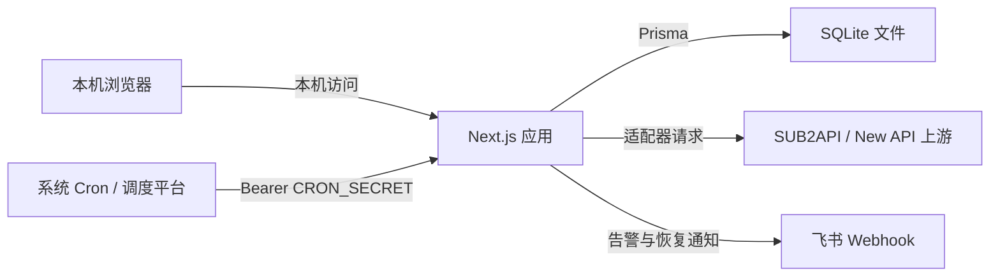
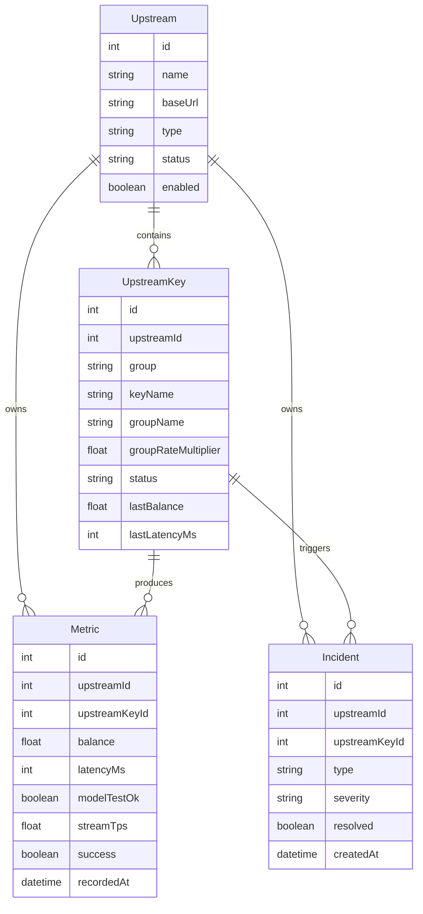
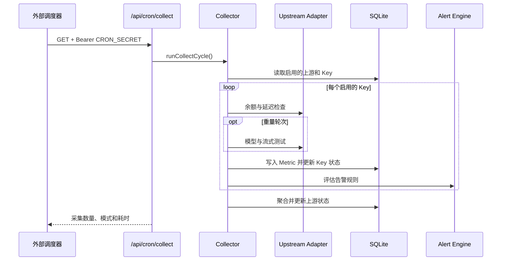

# RelayScope 系统架构

本文描述公开版本的系统边界、核心数据流和扩展方式。示例名称和地址均为合成内容。

## 设计目标

- 在一个面板中管理多个 AI API 中转站及其 Key/分组。
- 用轻量检查覆盖日常可用性，用低频重量测试验证真实生成能力。
- 将上游差异限制在适配器层，保持采集、告警和界面逻辑稳定。
- 常规 API 不向浏览器返回上游凭证明文或数据库中的加密值；只有本机显式点击小眼睛时才通过专用端点返回单个凭证。
- 支持单机自托管，并保留扩展新适配器和通知渠道的边界。

## 系统上下文



Next.js 14.2.35 同时承载界面、API Route 和服务端业务逻辑。运行时要求 Node.js 22.5 以上，初始化脚本使用内置 `node:sqlite`。SQLite 是单机持久化数据源；本地运行时由应用内调度器每分钟触发，也可由外部 Cron 调用鉴权端点。应用负责决定本轮执行轻量还是重量采集。

自动采集、单模型测试、站点测试和测试全部共享进程内凭证队列。队列键由标准化站点地址和解密后的 API 凭证生成哈希：同一凭证跨请求串行，不同凭证并行。自动轮次之间仍互斥，避免调度积压；手动任务可与自动轮次并行，并在命中同一凭证时等待前序任务完成。

## 模块边界

| 模块 | 职责 |
| --- | --- |
| Dashboard 页面 | 总览、上游管理、上游详情、告警事件、系统设置和内嵌使用帮助 |
| API Routes | 登录、CRUD、指标查询、手动刷新、手动测试与 CRON 入口 |
| Adapter | 屏蔽不同上游的认证方式、字段结构和请求端点差异 |
| Collector | 解密凭证、执行采集、写入指标、更新 Key/上游状态 |
| Alert Engine | 按 Key 评估规则、执行冷却、创建或自动恢复事件 |
| Notification Channel | 将告警和恢复事件发送到已启用渠道 |
| Prisma | 数据访问、关系约束和级联清理 |
| Local Backup | 手动生成 SQLite 一致性快照并保留对应 `.env.local` |

## 核心数据模型



其他配置实体包括：

- `AlertRule`：指标、比较符、阈值、严重级别和冷却时间。
- `AlertChannel`：通知渠道类型和 JSON 配置。
- `Setting`：采集间隔、测试模型、超时和 CRON 密钥等键值设置。
- `User`：管理员用户名和 bcrypt 密码哈希。

上游删除时，其 Key、指标和告警事件会按 Prisma 关系级联删除。Key 删除时，对应指标会级联删除，告警事件保留但解除 Key 关联。

## 采集流程

### 定时采集



外部调度器建议每分钟请求一次。当前采集器按“重量采集间隔”决定本轮模式：

- `light`：查询余额和 `/v1/models` 延迟，不发送生成请求。
- `heavy`：包含 light 的全部检查，并执行非流式与流式模型测试。

各 Key 的采集相互隔离；单个请求失败会写入该 Key 的指标和错误状态，不应阻断其他 Key。

### 手动刷新与测试

- `POST /api/upstreams/:id/refresh`：对目标上游的全部启用 Key 执行 light 采集。
- `POST /api/keys/:keyId/test`：对单个 Key 执行 heavy 采集。
- `POST /api/keys/:keyId/metadata`：重新同步支持的远端 Token/分组元数据。

刷新和测试完成后都会重新计算上游汇总状态。所有 Key 在线时上游为在线；全部离线时为离线；混合状态或存在降级时为降级；没有启用 Key 时为未知。

## 适配器接口

采集器只依赖统一的 `UpstreamAdapter`：

```ts
interface UpstreamAdapter {
  readonly type: UpstreamType;
  queryBalance(ctx: AdapterContext): Promise<BalanceResult>;
  testLatency(ctx: AdapterContext): Promise<LatencyResult>;
  testModel(ctx: AdapterContext, model: string): Promise<ModelTestResult>;
  testStream(ctx: AdapterContext, model: string): Promise<StreamTestResult>;
  listModels(ctx: AdapterContext): Promise<{
    ok: boolean;
    models?: string[];
    errorMessage?: string;
  }>;
  fetchKeyMetadata?(ctx: AdapterContext): Promise<KeyMetadataResult>;
}
```

### SUB2API

- API Key 通过 Bearer Header 访问用量、模型列表和 Chat Completions。
- 余额字段按 `remaining`、`balance`、`quota.remaining` 等兼容顺序解析。
- 普通 API Key 无法保证访问管理接口，分组元数据只采用响应中明确存在的字段。

### New API

- API Key 用于 Token 用量、模型列表和 Chat Completions。
- Access Token 与用户 ID 用于 `/api/user/self`、Token 搜索和用户分组配置。
- Access Token 与用户 ID 按站点账户共享；新增分组未显式提供时，服务端直接继承本站已有的加密值，不向前端回传明文。
- `/api/user/self` 的用户分组不能替代 Token 的真实分组。
- 元数据同步允许部分成功：已经获取到的名称或分组可以保存，失败信息单独记录，旧值不会被无条件清空。

## 告警流程

每次 Key 采集结束后，告警引擎评估全部启用规则：

- 余额低于或高于阈值；
- 延迟高于或低于阈值；
- 连续失败次数达到阈值；
- 最近一小时可用率低于阈值。

触发规则后，系统先检查同一 Key、同一事件类型的冷却窗口，再创建 `Incident`。当前通知实现会向所有已启用的飞书渠道发送交互式卡片。Key 恢复在线后，未解决事件会自动标记为已恢复并发送恢复通知。

## API 边界

| API | 方法 | 用途 |
| --- | --- | --- |
| `/api/auth/login` | `POST` | 创建管理员会话 |
| `/api/upstreams` | `GET/POST` | 分页查询或创建上游 |
| `/api/upstreams/:id` | `GET/PUT/DELETE` | 获取、更新或删除上游 |
| `/api/upstreams/:id/keys` | `GET/POST` | 查询或创建 Key |
| `/api/upstreams/:id/refresh` | `POST` | 上游级轻量刷新 |
| `/api/keys/:keyId/test` | `POST` | 单 Key 完整测试 |
| `/api/keys/:keyId/metadata` | `POST` | 刷新远端 Key 元数据 |
| `/api/metrics` | `GET/DELETE` | 查询指标或清理历史指标 |
| `/api/incidents` | `GET` | 查询告警事件 |
| `/api/settings` | `GET/PUT` | 读取或更新系统设置 |
| `/api/cron/collect` | `GET` | 使用 CRON_SECRET 触发采集 |

除登录和 CRON 入口外，Dashboard 页面与 API 由登录中间件保护。CRON 入口不使用登录 Cookie，只接受独立 Bearer 密钥。

## 安全边界

- API Key 与 Access Token 使用 AES-256-GCM 加密，密钥由 `APP_ENCRYPTION_KEY` 通过 scrypt 派生。
- `pnpm db:backup` 仅手动执行，使用 SQLite `VACUUM INTO` 生成一致性快照，并将 `.env.local` 一并保存到 Git 忽略的敏感备份目录。
- 管理员密码只保存 bcrypt 哈希。
- 会话 JWT 通过 HttpOnly、SameSite Cookie 传递；生产模式下 Cookie 标记为 Secure。
- 面向浏览器的 Key DTO 移除密文，只暴露是否已配置凭证。
- `CRON_SECRET` 可以来自数据库设置或环境变量，数据库值优先。
- `AlertChannel.config` 和 `Setting` 可能包含敏感配置，因此数据库备份也应按密钥材料保护。
- 官方 Docker 配置只把端口绑定到 `127.0.0.1`。项目以本机或可信内网的单用户部署为边界，不把免登录面板直接暴露公网视为受支持场景。

`APP_ENCRYPTION_KEY` 不是可随意轮换的普通配置。直接更换会导致现有上游凭证无法解密，并使既有会话失效；轮换前必须先设计数据迁移。

## 扩展方式

### 新增上游类型

1. 扩展 Prisma `UpstreamType` 并更新数据库。
2. 实现 `UpstreamAdapter`，使用统一的超时与脱敏错误格式。
3. 在适配器注册表中注册实现。
4. 更新管理表单中的类型和凭证字段。
5. 验证轻量、重量、元数据、失败隔离和安全 DTO 行为。

### 新增通知渠道

1. 为新渠道定义最小配置结构。
2. 在通知分发器中增加渠道类型。
3. 对发送失败进行隔离，避免影响指标写入和其他渠道。
4. 在设置页提供创建、启用和删除能力。

## 运行约束

- SQLite 数据库适合单机自用；多人或多实例部署不在当前范围内。
- 重量测试会消耗上游额度，应使用较低频率和低成本模型。
- 应用进程不内置可靠的分布式调度器，生产环境应使用系统 cron 或外部调度平台。
- 多实例部署时，外部调度器只应触发一个入口，避免重复采集和重复告警。
- 删除上游属于破坏性操作，生产操作前应确保数据库备份可恢复。

## 动态价格观测

对支持用户日志接口的 New API 聚合站，采集器在重量测试轮次读取 `/api/log/self`，从当前 Token、模型和实际渠道最近一条消费日志中的 `model_ratio`、`completion_ratio`、缓存倍率与分组倍率还原实际路由价格。价格快照只有在发生变化或超过 24 小时未刷新时才写入 SQLite。余额接口返回的累计 Token 与 `actual_cost` 可作为另一条模型级倍率校验依据；观测值不会覆盖分组配置倍率，并在总览中优先于公开价格目录展示。价格变化达到 5% 且按两位小数显示后的倍率确实发生变化时，才会创建 `PRICE_CHANGED` 事件。这类事件需要用户确认，不会因为下一次连通检查成功而自动恢复。

分组保存时，前端对比保存前后的启用模型，并通过现有单模型测试端点依次测试新增项。总览的指标排序和分页在浏览器内计算；默认顺序通过 Pointer Events 实现整行拖动并保存至 `localStorage`，避免浏览器原生拖放改变鼠标状态，不修改 SQLite 结构。

站点详情的分组卡片展示最近一次重量测试的模型延迟和时间。单模型手动测试成功后，页面先使用测试响应即时更新该卡片，再以禁用缓存的详情请求复核数据库中的最新记录。

延迟指标和告警阈值在 SQLite 与内部逻辑中继续使用毫秒，页面、提示和新告警文案统一换算为秒。模型请求默认超时为 30 秒，系统设置仍保存为 `test_timeout_ms`，前端以秒编辑。

分组状态由当前轻量采集结果与每个启用模型最近一次重量测试共同决定。轻量采集可把无法连接的分组标为离线，但不能覆盖尚未恢复的模型失败；只有同一模型后续重量测试成功，才清除该模型造成的降级状态。
